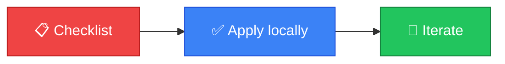

<p align="center">
  
</p>

<h1 align="center">accessibility-checklist</h1>

<p align="center">
  <strong>EN</strong> WCAG-oriented accessibility checklist for web apps and sites.<br/>
  <strong>PT</strong> Checklist de acessibilidade orientado a WCAG para apps e sites web.
</p>

<p align="center">
  <a href="https://github.com/manansbdb/accessibility-checklist/blob/main/LICENSE"></a>
  
  
  <a href="#support--apoio"></a>
</p>

---

## What it does / Para que serve

| English | Português |
|---------|-----------|
| WCAG-oriented accessibility checklist for web apps and sites. | Checklist de acessibilidade orientado a WCAG para apps e sites web. |



---

## Install / Instalação

### 1) Clone

```bash
git clone https://github.com/manansbdb/accessibility-checklist.git
cd accessibility-checklist
```

### Use / Usar

```bash
# open the files in this repo and copy what you need into your project
ls
```

### Requirements / Requisitos

- `git`
- No paid services required / Sem serviços pagos

---

## Files / Ficheiros

- `checklist.md` — full checklist / checklist completo
- `wcag-mapping.md` — criterion mapping notes / notas de mapeamento

---

## Support / Apoio

Bitcoin donations welcome / Doações em Bitcoin bem-vindas:

```
bc1q0qfnlnxyum9u45stzxe0a7jnhtj4j0usfkqdjw
```

**Network / Rede:** BTC (Bech32).

---

## License / Licença

[MIT](./LICENSE) © 2026 manansbdb
