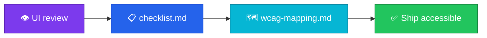

<p align="center">
  
</p>

<h1 align="center">accessibility-checklist</h1>

<p align="center">
  <strong>EN</strong> WCAG-oriented a11y checklist for product & engineering teams<br/>
  <strong>PT</strong> Checklist de acessibilidade orientada a WCAG para produto e engenharia
</p>

<p align="center">
  <a href="https://github.com/manansbdb/accessibility-checklist/blob/main/LICENSE"></a>
  
  
  <a href="#support--apoio"></a>
</p>

---

## What it does / Para que serve

| English | Português |
|---------|-----------|
| A practical **WCAG-oriented accessibility checklist** you can run before shipping UI. | Um **checklist de acessibilidade orientado a WCAG** para correr antes de publicar UI. |
| Includes mapping notes so teams know *why* each item matters. | Inclui notas de mapeamento para a equipa saber *porquê* cada item importa. |



---

## Install / Instalação

### 1) Clone / Clona

```bash
git clone https://github.com/manansbdb/accessibility-checklist.git
cd accessibility-checklist
```

### 2) Apply to your project / Aplica no teu projeto

```bash
mkdir -p docs/a11y
cp checklist.md docs/a11y/
cp wcag-mapping.md docs/a11y/
```

### 3) Use in PRs / Usa em PRs

Link `docs/a11y/checklist.md` from your PR template or review ritual.

### Requirements / Requisitos

- `git`
- No runtime dependencies

---

## Quick start / Início rápido

```bash
git clone https://github.com/manansbdb/accessibility-checklist.git
cd accessibility-checklist
# open checklist.md and tick items during UI review
```

---

## Contents / Conteúdos

| Path | Purpose / Função |
|------|------------------|
| `checklist.md` | a11y checklist items |
| `wcag-mapping.md` | WCAG criterion mapping |
| `SUPPORT.md` | Donations / Doações |

---

## Project layout / Estrutura

```text
accessibility-checklist/
├── docs/banner.svg
├── checklist.md
├── wcag-mapping.md
├── SUPPORT.md
└── README.md
```

---

## Support / Apoio

Bitcoin donations welcome / Doações em Bitcoin bem-vindas:

```
bc1q0qfnlnxyum9u45stzxe0a7jnhtj4j0usfkqdjw
```

See [SUPPORT.md](./SUPPORT.md).

---

## License / Licença

[MIT](./LICENSE) © 2026 manansbdb
